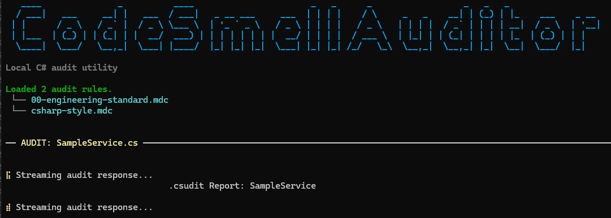

# CodeSmellAuditor

[](https://github.com/TimoKuronen/CodeSmellAuditor/actions/workflows/ci.yml)

Local-first CLI that reviews C# source against markdown governance rules using a local [Ollama](https://ollama.com/) model. It streams the critique live and saves a timestamped markdown report.

This is an **AI-assisted semantic code reviewer**, not a deterministic static analyzer. It does not use Roslyn or parse C# into a syntax tree; the LLM interprets plain source text against your rule packs.

Built while learning .NET architecture and agent-assisted workflows — the irony of using AI to audit AI-generated code is not lost on me.



## Requirements

- [.NET 10 SDK](https://dotnet.microsoft.com/download)
- [Ollama](https://ollama.com/) running locally with a pulled model (default: `qwen3.5:4b`)

## Run

```powershell
dotnet run --project CodeSmellAuditor.Cli
```

Drop `.cs` files into `WorkstationStorage/Targets/`, governance rules as `.mdc` into `WorkstationStorage/Rules/`. Reports land in `WorkstationStorage/Reports/`.

## Configuration

Environment variables (all optional):

| Variable | Default | Purpose |
|----------|---------|---------|
| `CODESMELL_STORAGE` | `WorkstationStorage` under repo root | Root folder containing `Rules/`, `Targets/`, `Reports/` |
| `CODESMELL_MODEL` | `qwen3.5:4b` | Ollama model name |
| `CODESMELL_NUM_CTX` | `8192` | Model context window passed to Ollama |
| `CODESMELL_NUM_PREDICT` | `1200` | Max output tokens for the critique |

## How it works

1. `Program.cs` (composition root) resolves paths and wires `MarkdownRuleRepository`, `OllamaAiOrchestrator`, and `AuditEngine`.
2. Core loads compact `.mdc` rules, reads each target `.cs` file, builds a budgeted prompt, and streams Ollama's response.
3. Cli renders progress through `SpectreAuditProgressReporter`; Core stays presentation-neutral via `IAuditProgressReporter`.
4. Each audit saves a markdown report with YAML front matter. Pass/fail is parsed from a `Status:` line in the report body.

Sample report format: [docs/sample-report-excerpt.md](docs/sample-report-excerpt.md)

More detail: [architecture](docs/architecture.md) · [known limitations](docs/known-limitations.md) · [testing](docs/testing.md)

## Tests

```powershell
dotnet test CodeSmellAuditor.slnx -c Release
```

**15 unit tests** covering rule loading, prompt building, pass/fail parsing, and `AuditEngine` orchestration with fakes. Ollama HTTP streaming is exercised manually, not in CI.

## Current scope

- Single-file `.cs` audits against local markdown rule packs
- Local Ollama only (privacy-preserving; no cloud API)
- Interactive CLI with streaming terminal output
- Layered Core / Cli / Tests solution with constructor injection at the composition root

## Future implementation

- CLI arguments (`--model`, `--storage`, `--non-interactive`) instead of env vars only
- Non-zero exit codes when any audit requires review
- Surface batch pass/fail summary in the CLI (engine already returns `AuditRunResult`)
- Roslyn-based deterministic pre-checks before the LLM pass
- Cloud model backend via a second `IAiOrchestrator` implementation

## License

MIT
