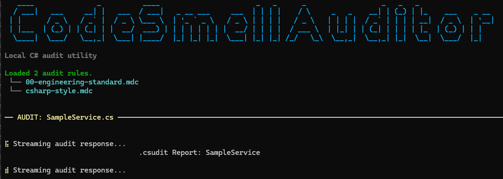

# CodeSmellAuditor

Local-first CLI that audits C# files and related file sets against markdown rule packs via [Ollama](https://ollama.com/). Streams the critique live and writes timestamped markdown reports.

This is an **AI-assisted semantic reviewer**, not a Roslyn/static analyzer: the model reads source text against your rule packs.

[](https://github.com/TimoKuronen/CodeSmellAuditor/actions/workflows/ci.yml)
[](LICENSE)



## Highlights

- Single-file and multi-path `sniff` against local markdown rule packs (`.mdc`); batch mode via `WorkstationStorage/Targets/`
- Opt-in stack packs via `--stack` (e.g. `Unity` under `Rules/Stacks/Unity/`); default packs stay stack-agnostic
- `sniff-system` for two or more related files (optional `--manifest`) using `Rules/Architecture/` and one combined report
- Local Ollama only — source stays on your machine
- Streaming console output with Spectre Status until first token; timestamped reports under `WorkstationStorage/Reports/`
- Pass/fail from the report `Status:` line (exit codes `0`/`1`); `Score` is informational only (not a regression metric)
- Layered Core / Cli with interfaces for rule loading and AI orchestration
- xUnit tests (fakes; no Ollama in CI) and Ubuntu GitHub Actions

## Architecture

```text
Program.cs (composition root)
  -> MarkdownRuleRepository / OllamaAiOrchestrator
  -> AuditEngine
  -> CliAuditHost (batch + sniff + sniff-system)
```

Details: [docs/architecture.md](docs/architecture.md)

## Stack

- C# / .NET 10
- [Ollama](https://ollama.com/) local HTTP API
- [Spectre.Console](https://spectreconsole.net/) (Status + streaming)
- xUnit
- Markdown rule packs (`.mdc`)

## Docs

- [Architecture](docs/architecture.md)
- [Sample report excerpt](docs/sample-report-excerpt.md)

## License

[MIT](LICENSE)
