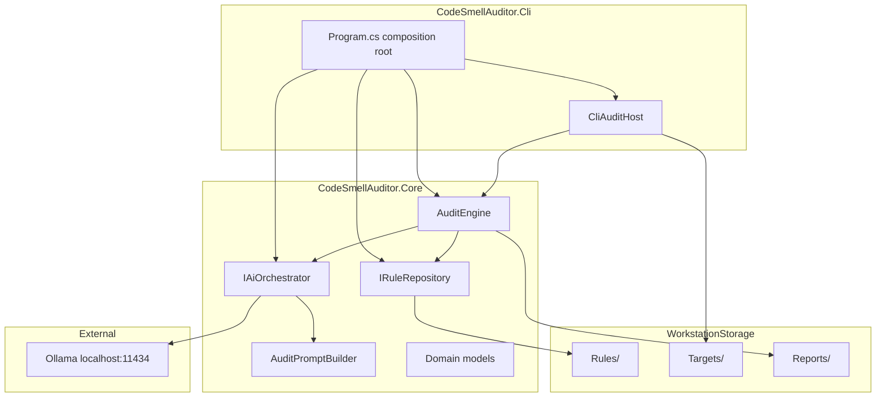

# Architecture

## Overview

CodeSmellAuditor follows a simple layered design with explicit interfaces so the audit engine stays independent of rule storage format and AI provider. Cli owns interactive presentation; Core owns rule loading, per-file audit, and report persistence.



## Projects

| Project | Responsibility |
|---------|---------------|
| CodeSmellAuditor.Cli | Composition root, `CliAuditHost` batch UX (Spectre Status + streaming), path configuration |
| CodeSmellAuditor.Core | `AuditEngine` file-level audit API, interfaces, Ollama HTTP streaming, prompt budgeting |

## Key types

### IRuleRepository

Loads active governance rules from a folder. `MarkdownRuleRepository` reads `.mdc` audit packs by default; reference `.md` manuals are excluded from runtime prompts. Compact excerpts keep prompts within local model context; report shape is owned by `AuditPromptBuilder`.

### IAiOrchestrator

Sends source code and rules to an AI backend and returns an `AuditReport`. `OllamaAiOrchestrator` streams tokens from Ollama `/api/chat` with a bounded output template.

### AuditPromptBuilder

Assembles system instructions, rule excerpts, and source text. Enforces a character budget before calling Ollama.

### AuditEngine

Presentation-neutral domain API:

1. `LoadRulesAsync` - load compact rules
2. `EnumerateTargetFiles` / `ResolveReportsDirectory` - storage helpers
3. `AuditFileAsync` - analyze one file, optional token callback, persist markdown report
4. `RunBatchAsync` - headless multi-file run for tests and non-interactive callers

### CliAuditHost

Owns the interactive batch loop. For each target it wraps `AuditFileAsync` in `AnsiConsole.Status()` so the spinner covers time-to-first-token, then streams tokens and prints the saved report path.

## Design decisions

| Decision | Rationale |
|----------|-----------|
| Interfaces for rules and AI | Swap rule packs or cloud API without changing engine |
| Cli owns Status wrapping | Spectre Status must wrap the await; presentation stays out of Core |
| File-level Core API | Keeps Core modular; Cli (or future sniff CLI) can drive one file at a time |
| Streaming token callback | Immediate feedback without Core knowing about the console |
| Compact `.mdc` rules at runtime | Keeps prompt size within local model context |
| Bounded report template | Prevents reasoning models from consuming output budget |
| Status line parsing | Deterministic pass/fail from `Status:` line |
| Env var for storage and model config | Portable across machines |

## Dependency direction

```
Cli -> Core -> (filesystem, HttpClient)
```

Core does not reference Cli. External AI and file I/O are behind interfaces or isolated in orchestrator implementations.

## CLI entry points

| Mode | Invocation | Source | Exit behavior |
|------|------------|--------|---------------|
| Batch | no args | `WorkstationStorage/Targets/*.cs` | Enter-to-exit; no exit code yet |
| Sniff | `sniff path\to\File.cs` | external path in place | no Enter wait; exit `0`/`1` from pass/fail |

Both modes reuse `CliAuditHost` Status wrapping and `AuditEngine.AuditFileAsync`. Rules and reports always come from auditor storage; sniff never copies into Targets.
