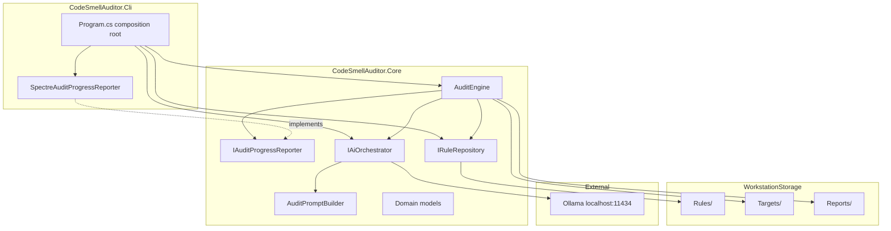

# Architecture

## Overview

CodeSmellAuditor follows a simple layered design with explicit interfaces so the audit engine stays independent of rule storage format and AI provider.



## Projects

| Project | Responsibility |
|---------|---------------|
| CodeSmellAuditor.Cli | Composition root, Spectre.Console UX via `SpectreAuditProgressReporter`, path configuration |
| CodeSmellAuditor.Core | AuditEngine orchestration, interfaces, Ollama HTTP streaming, prompt budgeting |

## Key interfaces

### IRuleRepository

Loads active governance rules from a folder. `MarkdownRuleRepository` reads `.mdc` audit packs by default; reference `.md` manuals are excluded from runtime prompts.

### IAiOrchestrator

Sends source code and rules to an AI backend and returns an `AuditReport`. `OllamaAiOrchestrator` streams tokens from Ollama `/api/chat` with a bounded output template.

### AuditPromptBuilder

Assembles system instructions, rule excerpts, and source text. Enforces a character budget before calling Ollama.

### AuditEngine

Coordinates the batch workflow:

1. Load compact rules
2. Enumerate `.cs` targets
3. Delegate per-file audit presentation to `IAuditProgressReporter`
4. Call AI orchestrator with streaming callback
5. Parse status and persist markdown report with YAML front matter
6. Return `AuditRunResult` with per-file pass/fail metadata

### IAuditProgressReporter

Presentation-neutral hook for workflow progress. `SpectreAuditProgressReporter` in Cli renders spinners, streaming output, and saved-report messages. `NullAuditProgressReporter` supports headless execution and testing without a terminal UI.

## Design decisions

| Decision | Rationale |
|----------|-----------|
| Interfaces for rules and AI | Swap rule packs or cloud API without changing engine |
| Streaming tokens to CLI | Immediate feedback during audit |
| Compact `.mdc` rules at runtime | Keeps prompt size within local model context |
| Bounded report template | Prevents reasoning models from consuming output budget |
| Status line parsing | Deterministic pass/fail from `Status:` line |
| Env var for storage and model config | Portable across machines |

## Dependency direction

```
Cli -> Core -> (filesystem, HttpClient)
```

Core does not reference Cli. External AI and file I/O are behind interfaces or isolated in orchestrator implementations.

## Future extensions

- `IRuleRepository` backed by a database or git-tracked rule pack
- `IAiOrchestrator` implementation for cloud APIs with routing policy
- Pre-AI deterministic analyzers (Roslyn-based) as guardrails before LLM critique
