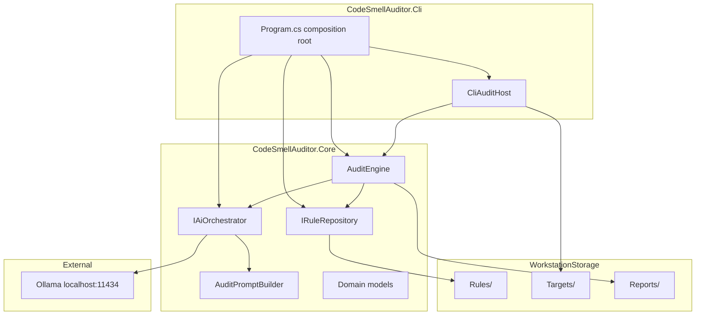

# Architecture

## Overview

CodeSmellAuditor follows a simple layered design with explicit interfaces so the audit engine stays independent of rule storage format and AI provider. Cli owns interactive presentation; Core owns rule loading, single-file and multi-file (system) audits, and report persistence.


```mermaid
flowchart TB
    subgraph cli [CodeSmellAuditor.Cli]
        Program[Program.cs composition root]
        Host[CliAuditHost]
    end

    subgraph core [CodeSmellAuditor.Core]
        Engine[AuditEngine]
        Rules[IRuleRepository]
        AI[IAiOrchestrator]
        PromptBuilder[AuditPromptBuilder]
        Models[Domain models]
    end

    subgraph storage [WorkstationStorage]
        RulesFolder[Rules/]
        TargetsFolder[Targets/]
        ReportsFolder[Reports/]
    end

    subgraph external [External]
        Ollama[Ollama localhost:11434]
    end

    Program --> Host
    Program --> Engine
    Program --> Rules
    Program --> AI
    Host --> Engine
    Engine --> Rules
    Engine --> AI
    AI --> PromptBuilder
    Rules --> RulesFolder
    Host --> TargetsFolder
    Engine --> ReportsFolder
    AI --> Ollama
```

## Projects

| Project | Responsibility |
|---------|---------------|
| CodeSmellAuditor.Cli | Composition root, `CliAuditHost` batch UX (Spectre Status + streaming), path configuration |
| CodeSmellAuditor.Core | `AuditEngine` file-level audit API, interfaces, Ollama HTTP streaming, prompt budgeting |

## Key types

### IRuleRepository

Loads active governance rules from a folder. `MarkdownRuleRepository` reads `.mdc` audit packs by default; reference `.md` manuals are excluded from runtime prompts. Compact excerpts keep prompts within local model context; report shape is owned by `AuditPromptBuilder`. Root `Rules/*.mdc` are stack-agnostic. Opt-in stack packs live under `Rules/Stacks/<name>/` (loaded only when `--stack` is set). Architecture packs under `Rules/Architecture/` are used by sniff-system.

### IAiOrchestrator

Sends source code and rules to an AI backend and returns an `AuditReport` with an `AuditOutcome` (`Passed`, `ReviewRequired`, or `Failed`). Supports single-file `AnalyzeCodeAsync` and multi-file `AnalyzeSystemAsync`. `OllamaAiOrchestrator` takes an injected `HttpClient` (bound at the composition root) and streams tokens from Ollama `/api/chat` with bounded output templates. Transport, empty-response, and budget failures map to `Failed` and are not persisted as critiques.

### AuditPromptBuilder

Assembles system instructions, rule excerpts, and source text. Enforces a character budget before calling Ollama.

### AuditEngine

Presentation-neutral domain API:

1. `LoadRulesAsync` - load compact rules (optional stack name concatenates `Rules/Stacks/<name>/`)
2. `LoadSystemRulesAsync` - Architecture packs plus optional stack packs for sniff-system
3. `EnumerateTargetFiles` / `ResolveExistingCsPaths` / `ResolveReportsDirectory` / `ResolveArchitectureRulesPath` / `ResolveStackRulesPath` - storage helpers
4. `AuditFileAsync` - analyze one file, optional token callback, persist markdown report when outcome is not `Failed`
5. `AuditSystemAsync` - analyze two or more files as one architecture audit (optional manifest text)
6. `RunBatchAsync` - headless multi-file run for tests and non-interactive callers

### SystemAuditPromptBuilder

Assembles architecture-mode system/user prompts (manifest + multi-file sources) with a larger character budget via `AuditConfiguration.ForSystemAudit`. Single-file prompts stay in `AuditPromptBuilder`.

### CliAuditHost

Owns the interactive batch loop. For each target it wraps `AuditFileAsync` in `AnsiConsole.Status()` so the spinner covers time-to-first-token, then streams tokens and prints the saved report path. `RunSniffSystemAsync` uses one Status wrap for the whole combined call.

## Design decisions

| Decision | Rationale |
|----------|-----------|
| Interfaces for rules and AI | Swap rule packs or cloud API without changing engine |
| Cli owns Status wrapping | Spectre Status must wrap the await; presentation stays out of Core |
| File-level Core API | Keeps Core modular; Cli drives one or more files via sniff while Core stays per-file; sniff-system is an explicit multi-file sibling API |
| Streaming token callback | Immediate feedback without Core knowing about the console |
| Compact `.mdc` rules at runtime | Keeps prompt size within local model context |
| Architecture rules under `Rules/Architecture/` | System audits do not inflate single-file prompts |
| Stack packs under `Rules/Stacks/<name>/` | Unity (and future stacks) are opt-in via `--stack`; default packs stay stack-agnostic |
| Bounded report template | Prevents reasoning models from consuming output budget |
| Status line parsing | Deterministic pass/fail from `Status:` line |
| Score is informational | Model-emitted qualitative signal; not used for exit codes or regression |
| Env var for storage and model config | Portable across machines |

## Dependency direction

```
Cli -> Core -> (filesystem, HttpClient)
```

Core does not reference Cli. External AI and file I/O are behind interfaces or isolated in orchestrator implementations.

## CLI entry points

| Mode | Invocation | Source | Exit behavior |
|------|------------|--------|---------------|
| Batch | no args | `WorkstationStorage/Targets/*.cs` | Summary; exit `0`/`1`/`2`; Enter-to-exit unless `--non-interactive` |
| Sniff | `sniff path\to\File.cs [more.cs...]` | one or more external paths in place | no Enter wait; exit `0`/`1`/`2` from aggregate outcome |
| Sniff-system | `sniff-system path\to\A.cs path\to\B.cs [...]` | two or more external paths; optional `--manifest` | one combined architecture report; no Enter wait; exit `0`/`1`/`2` |

### Shared options

| Flag | Purpose | Override |
|------|---------|----------|
| `--model <name>` | Ollama model for this run | `CODESMELL_MODEL` wins when set |
| `--storage <path>` | WorkstationStorage root | `CODESMELL_STORAGE` wins when set |
| `--stack <name>` | Opt-in stack pack under `Rules/Stacks/<name>/` (e.g. `Unity`) | — |
| `--manifest <path>` | Free-text architecture contract (sniff-system only) | — |
| `--non-interactive` | Skip batch Enter wait | — |

Flags may appear before or after `sniff` / `sniff-system`. Example: `dotnet run --project CodeSmellAuditor.Cli -- --model qwen3.5:4b --non-interactive`.

Batch and sniff reuse `CliAuditHost` Status wrapping and `AuditEngine.AuditFileAsync` with root `Rules/*.mdc`. Optional `--stack` concatenates `Rules/Stacks/<name>/*.mdc` onto that set. Sniff-system uses `AuditEngine.LoadSystemRulesAsync` (Architecture packs plus optional stack packs), `AuditSystemAsync` / `AnalyzeSystemAsync` with a larger `AuditConfiguration.ForSystemAudit` budget, and writes one `SystemAudit_*_Critique.md` report when the outcome is not `Failed`. Rules and reports always come from auditor storage; sniff modes never copy into Targets. Empty batch runs (no `*.cs` targets) exit `1`. Wiring and missing-path errors at the CLI exit `2`. Multi-path sniff loads rules once and audits files sequentially. `scripts/sniff.ps1` forwards `-Target` paths plus optional `-Model` / `-Storage` / `-Stack`; `-System` and `-Manifest` map to `sniff-system`.

### Report contract

| Field | Role |
|-------|------|
| `Status:` | Sole model pass/fail signal (`COMPLIANT` or `REVIEW REQUIRED`). Maps to exit `0` or `1`. |
| Tool failure | Ollama unreachable, empty response, budget exceeded, or CLI wiring errors. Maps to `AuditOutcome.Failed` / exit `2`; no critique file written. |
| `Score:` | Rough qualitative signal for that run only. Model-emitted, non-deterministic; not a regression metric. Prefer Status and Top Findings over Score deltas between runs. |

### Exit codes

| Code | Meaning |
|------|---------|
| `0` | Every audited target passed (`COMPLIANT`) |
| `1` | At least one `REVIEW REQUIRED`, or empty batch (nothing to pass); no tool failures |
| `2` | At least one tool/wiring failure (`Failed`), or CLI could not start the audit (missing Rules/Targets, bad paths, missing stack folder) |
